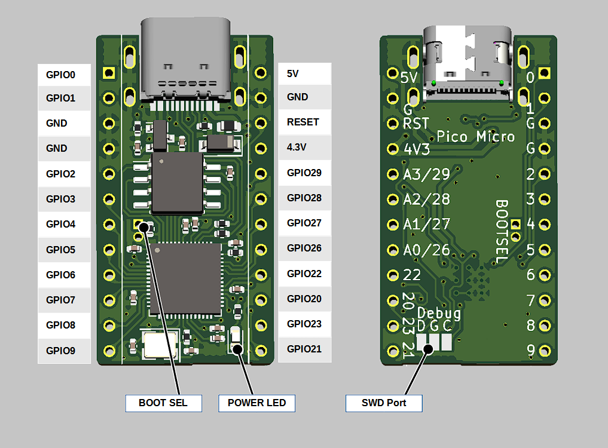

# Pico Micro

Pro Microと互換性のあるフットプリントを採用したRP2040のブレークアウト基板です。USBコネクタにはミッドマウントのUSB Type-Cレセプタクルを採用し、基板の高さを抑えています。

RP2040はRaspber Pi財団が開発したマイコンで、ARM Cortex-M0+のデュアルコア(133MHz)を搭載し、264kBのSRAM, I2C, UART, SPI, ADC, PIO, USBといった機能が利用できます。

## 販売ページ

- [BOOTH](https://nogikes.booth.pm/items/3214808)

## 仕様

- ROM: 2MB, RAM: 264kB
- GPIO: 18ピン (うちADC対応4ピン)
  - 3.3V (**5Vトレラントではありません**)
  - ピンヘッダ取り付け穴径0.85mmでコンスルーに対応
- 電源
  - 入力: 3.7~6V
  - 出力 (USB接続時): 5V (RAW), 4V (VCC)
    - 500mA PTC搭載
    - VCCから電源供給することで3.3V IOによるシリアルLED駆動が可能
- 電源確認用LED
- SWD用ポート

## ピン配置

## 注意点など

Pro MicroのVCCに当たるピンは三端子レギュレータの前段につながっています。Pro Microの場合はレギュレータの後段に繋がっているため回路設計の際には注意が必要です。

BOOTSELピンは基板上のスルーホールに引き出されています。ブートローダを起動する際はピンセットなどを使ってこの部分をショートさせるか、書き込むファームウェアで`pico_bootsel_via_double_reset`などの機能を有効化しておいてください。